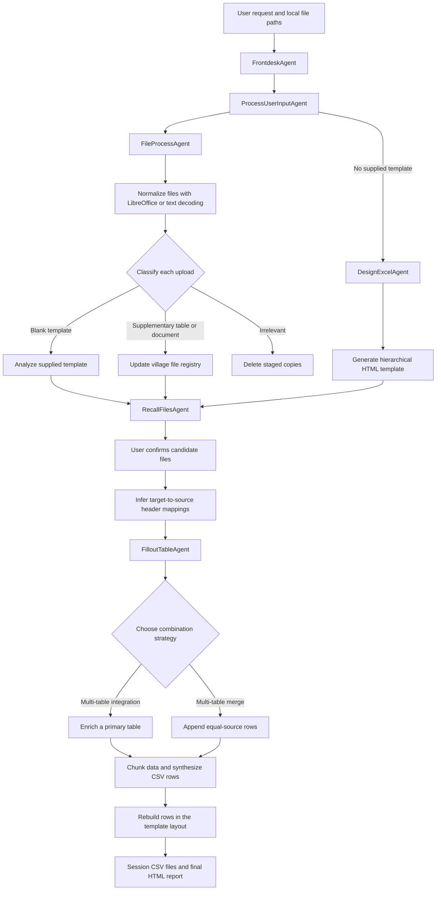

# UAIassist / ExcelAssist

> A stateful, multi-agent spreadsheet assistant for turning village-level administrative data and policy documents into completed report tables.
>
> 面向村级行政场景的状态化多智能体表格助手，用于将行政数据与政策文档转换为已填写的报表。

[English](#english) | [中文](#中文)

---

## English

### Overview

UAIassist, called **ExcelAssist** in the source code, is an AI (Artificial Intelligence)-assisted table-processing prototype developed during a software engineering internship at China Unicom in Beijing from **May 2025 to August 2025**.

The broader internship project was an enterprise intelligent-data platform that unified the ingestion of Word files, PDF (Portable Document Format) files, images, Excel workbooks, and CSV (Comma-Separated Values) data. Unstructured content was intended for vector retrieval, while structured content was intended for PostgreSQL. That platform supported document search, SQL (Structured Query Language) queries, and report generation.

**This repository contains the agentic spreadsheet/report-generation branch of that broader effort.** Its implemented scope is more specific:

- ingest local spreadsheet, office-document, and text files;
- convert their contents into normalized text or HTML (HyperText Markup Language);
- classify uploads as templates, supplementary tables, supplementary documents, or irrelevant files;
- maintain a village-scoped file registry;
- design a table template when the user does not provide one;
- recall candidate source files and ask the user to confirm them;
- infer mappings between target headers and source fields;
- choose between multi-table integration and multi-table row merging;
- synthesize target CSV data in parallel; and
- preserve the uploaded template's table structure while generating a final HTML report.

The current repository snapshot does **not** include the PostgreSQL or vector-database services from the broader platform. File recall here is performed from summaries stored in `agents/data.json`, followed by Large Language Model-based selection and human confirmation.

### Why this project exists

Village committees repeatedly prepare administrative forms for subsidies, insurance, party-member records, demographic records, disability assistance, veterans, and similar workflows. The required facts are often spread across multiple workbooks and policy documents, while the destination form may contain merged cells, multi-level headers, calculated totals, or fields that require policy-based reasoning.

UAIassist turns that work into a stateful workflow:

1. understand the requested report and its template;
2. discover the relevant local data sources;
3. map source fields and policy rules to destination fields;
4. combine or merge the source tables;
5. generate the completed rows; and
6. reconstruct the result using the original table layout.

### Key capabilities

- **Stateful orchestration** — LangGraph `StateGraph` workflows carry session identifiers, messages, template structures, field mappings, selected files, and generated content between nodes.
- **Human-in-the-loop decisions** — LangGraph interrupts and tool calls request clarification, template selection, source-file confirmation, or design feedback.
- **Template-first processing** — a supplied blank workbook can be analyzed, or a new hierarchical template can be designed from a natural-language requirement.
- **Hierarchical headers** — parent fields can contain their own value, decomposed child fields, and a calculation rule through the `值 / 分解 / 规则` (value / decomposition / rule) structure.
- **Village-scoped organization** — source files and summaries are grouped by village name, providing a prototype form of tenant separation.
- **Multi-source mapping** — destination columns can map to direct source fields, multiple possible source fields, or explicit inference and calculation rules.
- **Two data-combination modes** — one main table can be enriched by supporting tables, or equal-schema tables can have their rows appended together.
- **Parallel processing** — file analysis and data-chunk generation use `ThreadPoolExecutor`; LangGraph `Send` branches also run independent preparation steps before joining.
- **Layout-preserving output** — header, empty-row, and footer fragments are extracted from the normalized template and recombined with synthesized data.
- **Model-provider routing** — GPT (Generative Pre-trained Transformer) models use the OpenAI Application Programming Interface (API); DeepSeek and Qwen models use the SiliconFlow-compatible endpoint.
- **Retry and observability** — model calls implement rate-limit detection, exponential backoff with jitter, token/timing output when available, state-oriented console logs, and fallback paths for malformed model responses.

### End-to-end workflow


```mermaid
flowchart TD
    U["User request and local file paths"] --> F["FrontdeskAgent"]
    F --> P["ProcessUserInputAgent"]
    P --> X["FileProcessAgent"]
    X --> N["Normalize files with LibreOffice or text decoding"]
    N --> C{"Classify each upload"}
    C -->|"Blank template"| T["Analyze supplied template"]
    C -->|"Supplementary table or document"| R["Update village file registry"]
    C -->|"Irrelevant"| D["Delete staged copies"]
    P -->|"No supplied template"| G["DesignExcelAgent"]
    G --> H["Generate hierarchical HTML template"]
    T --> Q["RecallFilesAgent"]
    H --> Q
    R --> Q
    Q --> V["User confirms candidate files"]
    V --> M["Infer target-to-source header mappings"]
    M --> O["FilloutTableAgent"]
    O --> S{"Choose combination strategy"}
    S -->|"Multi-table integration"| I["Enrich a primary table"]
    S -->|"Multi-table merge"| J["Append equal-source rows"]
    I --> K["Chunk data and synthesize CSV rows"]
    J --> K
    K --> L["Rebuild rows in the template layout"]
    L --> Z["Session CSV files and final HTML report"]
```

### Agent architecture

| Component | Responsibility | Important state or output |
| --- | --- | --- |
| `FrontdeskAgent` | Top-level coordinator; routes between input collection, template analysis/design, file recall, and table filling | `session_id`, `village_name`, `template_structure`, `headers_mapping`, recalled files |
| `ProcessUserInputAgent` | Collects terminal input, extracts file paths, validates text relevance, summarizes the turn, and chooses the next node | uploaded file paths, validation result, template path, next-node decision |
| `FileProcessAgent` | Normalizes uploads, classifies each file, moves files into final storage, and updates the registry | template files, supplementary tables/documents, irrelevant files, template complexity |
| `DesignExcelAgent` | Designs a hierarchical table from a user requirement and village file summaries; collects feedback; generates an HTML template | JSON (JavaScript Object Notation) template structure and template path |
| `RecallFilesAgent` | Selects likely source tables/documents from the village registry, asks the user to confirm them, and creates target-to-source mappings | confirmed files, classified files, header mappings |
| `FilloutTableAgent` | Selects the data-combination strategy, chunks source data, generates target rows, and rebuilds the final table | synthesized CSV data, extracted HTML fragments, combined HTML |

Two additional files represent unfinished experiments rather than the active workflow:

- `agents/fillterGeneratedTable.py` sketches post-generation filtering and template modification.
- `utils/filter_tools.py` is an incomplete tool experiment.

### State and routing design

The project uses a nested-graph design rather than one large linear script. Each agent owns a `TypedDict` state and exposes a compiled graph. The front desk invokes the lower-level agents as workflow nodes.

Important orchestration patterns include:

- `add_messages` reducers for LangChain message history;
- a custom append reducer for chat-history strings;
- `MemorySaver` checkpoints for interactive subgraphs;
- `interrupt(...)` and `Command(resume=...)` for terminal-based user interaction;
- conditional edges driven by template complexity, validation results, tool calls, and model-produced route names;
- `Send(...)` fan-out for file-type processing and parallel template/data preparation; and
- field reducers that preserve whichever concurrent branch returns a non-empty HTML fragment.

The top-level flow currently routes complex uploaded templates to the simple-template handler. Dedicated complex-template analysis remains a placeholder.

### File ingestion and normalization

`utils/file_process.py` detects paths in user text, copies original files into a session staging directory, and produces a normalized `.txt` representation.

| Input category | Recognized extensions | Current behavior |
| --- | --- | --- |
| Spreadsheets | `.xlsx`, `.xls`, `.xlsm`, `.ods`, `.csv` | LibreOffice converts the workbook to HTML; styling metadata is stripped while table structure, `rowspan`, and `colspan` are preserved |
| Office documents | `.docx`, `.doc`, `.pptx`, `.ppt` | LibreOffice converts content to UTF-8 (8-bit Unicode Transformation Format) text |
| Text-like files | `.txt`, `.md`, `.json`, `.xml`, `.html`, `.htm`, `.py`, `.js`, `.css`, `.sql`, `.log` | decoded directly with UTF-8, GB18030, GBK, Big5, or detected encoding |
| Images | `.jpg`, `.jpeg`, `.png`, `.gif`, `.bmp`, `.tiff`, `.tif`, `.webp`, `.svg` | only filename, size, and format metadata are normalized; general image Optical Character Recognition (OCR) is not implemented |
| Other binary files | any other extension | only filename, size, and detected media type are recorded |

Although `pypdf` is pinned in the environment, PDF parsing is not wired into `process_file_to_text` in this snapshot. Spreadsheet screenshots are a separate path: Microsoft Excel is automated through `xlwings`, the used range is copied as an image, and a Qwen vision model extracts the table structure.

### Upload classification and registry

Every normalized upload is independently classified into one of four categories:

- `template`: a blank table or a table containing only a small example;
- `supplement-表格`: a populated spreadsheet used as a data source;
- `supplement-文档`: a policy or explanatory document used as context; or
- `irrelevant`: a file unrelated to the table-generation task.

Classification tasks run concurrently with at most five workers. Supplementary files are also analyzed concurrently. Table summaries describe hierarchical headers, while document summaries extract one or two important rules or policy facts.

`agents/data.json` acts as a lightweight metadata registry:

```json
{
  "Village name": {
    "表格": {
      "Source table name": {
        "summary": "Hierarchical table structure",
        "file_path": "Normalized content path",
        "original_file_path": "Original workbook path",
        "timestamp": "Ingestion time",
        "file_size": 12345
      }
    },
    "文档": {}
  }
}
```

The registry is updated through a temporary file followed by an atomic rename. Duplicate names are updated, irrelevant staged files are removed, and all entries are namespaced by `village_name`.

### Template representation

The canonical template format supports simple fields and grouped/calculated fields:

```json
{
  "表格标题": "Example Village 2025 Subsidy Report",
  "表格结构": {
    "序号": [],
    "户主姓名": [],
    "领取金额": {
      "值": ["推理规则: 家庭补差 + 重点救助 + 残疾人救助"],
      "分解": {
        "家庭补差": [],
        "重点救助": [],
        "残疾人救助": []
      },
      "规则": "家庭补差 + 重点救助 + 残疾人救助"
    }
  }
}
```

Interpretation rules:

- a simple `"field": []` becomes one destination column;
- a parent whose `值` is empty is a grouping header and does not become a data column;
- every child under `分解` becomes a destination column;
- a non-empty parent `值` means the parent itself also becomes a column; and
- `规则` records how a parent value or derived field should be calculated.

`utils/html_generator.py` converts this structure into a table with the required `rowspan` and `colspan`, then later extracts header, empty-row, and footer fragments from a supplied template.

### File recall and field mapping

Recall is performed in three stages:

1. all summaries under the selected village are provided to the model;
2. the model proposes four to six candidate tables or documents and must call a clarification tool; and
3. after user confirmation, the selected file list is parsed and classified as table or document sources.

The mapping step annotates each destination field with one of the following:

- `source-file: source-field` for a direct mapping;
- multiple mappings separated by `/` when equal data sources can supply the same target field; or
- `推理规则: ...` for calculation, filtering, policy interpretation, or another derived value.

Policy-document summaries are added as context so that fields such as eligibility, subsidy rate, age range, or total amount can be derived when no direct column exists.

### Data combination and report generation

The fill workflow chooses one of two strategies:

#### Multi-table integration (`多表整合`)

One table is treated as the primary record set. The table with the greatest row count is split into chunks, while the remaining tables and policy context are attached as supplementary information. This is appropriate when different files provide different fields for the same people or entities.

#### Multi-table merge (`多表合并`)

All tables are treated as equal row sources. Header/data pairs from every source are appended, source provenance is preserved in the prompt context, and the total output row count is based on all inputs. This is appropriate for files such as equivalent urban and rural rosters.

After strategy selection:

1. pre-generated source CSV files under the village data directory are read;
2. source rows are divided into chunks with a configured target of fifteen chunks;
3. chunks are processed concurrently by the model;
4. both raw reasoning output and cleaned data-only CSV files are written;
5. template headers, one empty data row, and the footer are extracted in parallel;
6. generated values are inserted into copies of the empty row; and
7. the fragments are combined into `combined_html.html`.

### Model configuration

The source currently references these model families:

| Use | Model or provider |
| --- | --- |
| Tool calling and file confirmation | `gpt-4o` through OpenAI |
| Text validation, routing, template design, classification, mapping, and row synthesis | DeepSeek V3 variants through SiliconFlow |
| Spreadsheet screenshot understanding | `Qwen/Qwen2.5-VL-72B-Instruct` through SiliconFlow |

Model selection is currently embedded in agent methods rather than centralized in a configuration file.

### Repository layout

```text
UAIassist/
├── agents/
│   ├── DriverAgent.py              # Top-level front desk graph
│   ├── processUserInput.py         # Input collection, validation, routing
│   ├── fileProcessAgent.py         # Ingestion, classification, registry updates
│   ├── designExcelAgent.py         # Template design and HTML generation
│   ├── recallFilesAgent.py         # Source-file recall and header mapping
│   ├── filloutTable.py             # Combination, CSV synthesis, final report
│   ├── fillterGeneratedTable.py    # Unfinished post-generation experiment
│   └── data.json                   # Village-scoped metadata registry
├── utils/
│   ├── file_process.py             # Conversion, storage, chunking, CSV utilities
│   ├── html_generator.py           # Hierarchical template and report HTML
│   ├── modelRelated.py             # Provider routing and retry logic
│   ├── screen_shot.py              # Microsoft Excel screenshot capture
│   ├── clean_response.py           # Model-response cleanup
│   └── message_process.py          # Message and attachment preparation
├── agents_workflow_diagram/             # Historical workflow images
├── 文件/                                # Sample workbooks
├── test_*.py                            # HTML-generator smoke-test scripts
├── environment.yml                      # Conda environment snapshot
├── CLAUDE.md                            # Development notes
└── coomand.txt                          # Historical LibreOffice commands
```

Runtime directories are created as needed:

```text
conversations/{session_id}/
├── user_uploaded_files/
│   └── template/
├── CSV_files/
└── output/

files/{village_name}/
├── table_files/
│   ├── original/
│   ├── html_content/
│   ├── screen_shot/
│   └── CSV_files/
└── document_files/
    ├── original/
    └── txt_content/
```

### Requirements

The current implementation was developed for Windows and assumes:

- Conda;
- the pinned Python environment in `environment.yml`;
- LibreOffice installed at `D:\LibreOffice\program\soffice.exe`;
- desktop Microsoft Excel for workbook screenshot capture;
- OpenAI and SiliconFlow credentials; and
- access to the local files entered at the terminal.

The screenshot code imports `xlwings` and `psutil`, but those packages are not listed in the committed `environment.yml`. Install them separately if that path is used.

### Installation

```powershell
git clone https://github.com/lululuyuanyuanyuanGe/UAIassist.git
Set-Location UAIassist

conda env create -f environment.yml
conda activate YaxinAiAssist

# Required by spreadsheet screenshot capture but absent from environment.yml
pip install xlwings psutil
```

Create a local `.env` file or set the variables in the shell:

```dotenv
OPENAI_API_KEY=your_openai_key
SILICONFLOW_API_KEY=your_siliconflow_key
```

Do not commit credentials. The repository does not include an `.env.example`, so create `.env` manually.

### Running the prototype

The current snapshot has two pre-existing f-string quote errors in `agents/filloutTable.py`: both `len(state["data_file_path"])` expressions use the same double quotes as their enclosing f-strings. Change the inner key quotes to single quotes before starting the top-level workflow. This README-only change intentionally does not alter the implementation.

After correcting those two expressions, start the top-level terminal workflow:

```powershell
python agents/DriverAgent.py
```

The current entry point uses `燕云村` as the default village. During the interactive prompt, describe the report and include accessible Windows file paths, for example:

```text
请根据 D:\data\燕云村村民信息.xlsx 和 D:\data\补贴政策.docx，
填写 D:\data\待填补贴登记表.xlsx。
```

For another village, change the example call at the bottom of `agents/DriverAgent.py` or invoke the class directly with a different `village_name`.

Expected final artifacts are conceptually:

```text
conversations/{session_id}/CSV_files/synthesized_table_with_thinking.csv
conversations/{session_id}/CSV_files/synthesized_table_with_only_data.csv
conversations/{session_id}/output/combined_html.html
```

One save path is currently hard-coded to `D:\asianInfo\ExcelAssist\conversations\...`, while the HTML stage reads a repository-relative path. Align those paths before running on a different machine.

### Smoke tests

The repository includes script-based checks for hierarchical HTML generation:

```powershell
python test_generate_header.py
python test_header_simple.py
python test_enhanced_html_generator.py
python debug_html_structure.py
```

These scripts write HTML files into the repository and visually or programmatically check basic structure. They are not a complete automated test suite, and the full agent workflow requires external model services, LibreOffice, Microsoft Excel, and representative local files.

### Current limitations

This is an internship-era prototype and should be evaluated accordingly:

- Windows drive paths and the LibreOffice executable path are hard-coded in several functions.
- The active `agents/filloutTable.py` file contains two f-string parse errors in the current snapshot, so the main entry point cannot start until their inner dictionary-key quotes are corrected.
- The runtime registry contains historical machine-specific paths and should be rebuilt for a new environment.
- File recall uses `agents/data.json` summaries, not the vector retrieval system described in the broader internship platform.
- PostgreSQL ingestion and SQL query execution are not present in this repository snapshot.
- PDF text extraction and general image OCR are not connected to the ingestion pipeline.
- Complex uploaded templates fall back to the simple-template flow.
- HTML-to-Excel conversion is a placeholder, so the implemented final report format is HTML plus CSV rather than a finished workbook.
- The post-generation filtering agent and filter-tool module are incomplete and are not part of the active graph.
- The unfinished `agents/fillterGeneratedTable.py` and `utils/filter_tools.py` experiments also contain syntax errors.
- Model names, worker counts, and most paths are embedded in code.
- `MemorySaver` is in-process memory, not durable cross-process session storage.
- User interaction is terminal-based; imported Gradio code is not wired into a launched web interface.
- Model-generated mappings and rows need human review before use in administrative or financial decisions.
- The sample registry and workbooks may contain sensitive personal information; production use requires access control, encryption, audit logging, retention rules, and data desensitization.

### Suggested productionization path

1. centralize model, path, and worker configuration;
2. remove absolute Windows paths and make LibreOffice discovery configurable;
3. add first-class PDF and image OCR adapters;
4. replace `data.json` with durable metadata storage and connect the broader PostgreSQL/vector retrieval layer;
5. introduce authentication, village-level authorization, audit logs, and secret management;
6. validate every model response against typed schemas;
7. add deterministic joins and calculations for high-risk fields instead of relying only on model generation;
8. complete workbook export and preserve styles in a native Excel output;
9. add unit, integration, end-to-end, and regression tests with sanitized fixtures; and
10. expose the graph through a supported web or service interface.

### Project period

- Internship context: **May 2025 – August 2025**
- Repository implementation history: **June 2025 – August 2025**
- Organization and location: **China Unicom, Beijing, China**

No license file is included in the repository. Unless a license is added, reuse and redistribution rights are not granted by default.

---

## 中文

### 项目概述

UAIassist 在代码中也称为 **ExcelAssist**，是一个智能表格处理原型。项目开发于 **2025 年 5 月至 2025 年 8 月**在中国联通北京的软件工程实习期间。

实习所在的更完整项目是一个企业级智能数据平台：统一处理 Word、PDF（便携式文档格式）、图片、Excel 和 CSV（逗号分隔值）文件，将非结构化内容接入向量检索，将结构化数据接入 PostgreSQL，以支持文档检索、SQL（结构化查询语言）查询和报告生成。

**本仓库保留的是上述平台中偏表格填报与报告生成的智能体分支。** 当前代码的实际范围为：

- 读取本地表格、办公文档和文本文件；
- 将文件内容归一化为文本或 HTML（超文本标记语言）；
- 将上传文件分类为模板、补充表格、补充文档或无关文件；
- 维护以村名为命名空间的文件摘要注册表；
- 在用户没有提供模板时自动设计分层表格；
- 召回候选数据源并请用户确认；
- 推断目标表头与源文件字段之间的映射；
- 在“多表整合”和“多表合并”之间选择处理策略；
- 并行生成目标 CSV 数据；
- 在保留上传模板表格结构的基础上生成最终 HTML 报表。

需要特别说明：当前仓库快照中不包含更大平台的 PostgreSQL 服务和向量数据库服务。本仓库的“文件召回”是先读取 `agents/data.json` 中的文件摘要，再由大语言模型筛选，并交由用户确认。

### 项目解决的问题

村委会在补贴发放、保险登记、党员名册、人口信息、残疾人救助和退役军人管理等场景中，经常需要重复填写行政表格。所需信息可能分散在多份工作簿和政策文档中，目标模板又可能包含合并单元格、多级表头、汇总列或需要根据政策推导的字段。

UAIassist 将这个过程组织成一条有状态的工作流：

1. 理解用户需求和待填模板；
2. 找到相关的本地数据源；
3. 将源字段和政策规则映射到目标字段；
4. 整合或合并多张源表；
5. 生成完整的目标数据行；
6. 按照原模板布局重建结果。

### 核心能力

- **状态化编排**：基于 LangGraph `StateGraph` 在节点之间传递会话标识、消息、模板结构、字段映射、已选文件和生成内容。
- **人机协同**：通过 LangGraph 中断和工具调用请用户补充信息、选择模板、确认数据源或反馈表格设计。
- **模板优先**：可以分析用户提供的空白工作簿，也可以根据自然语言需求自动设计新模板。
- **多级表头**：通过“值 / 分解 / 规则”结构表示父字段自身的值、子字段以及计算关系。
- **按村隔离**：所有数据源与摘要都以村名分组，形成原型阶段的多租户命名空间。
- **多源字段映射**：目标列可以来自直接源字段、多个候选字段，也可以根据公式、筛选条件或政策规则推导。
- **两种多表策略**：支持以一张主表为基础、其他表补充字段，也支持将同类表的数据行追加到一起。
- **并行处理**：文件分析和数据分块使用 `ThreadPoolExecutor`，LangGraph `Send` 分支负责并行执行可独立的处理节点。
- **保留布局的输出**：从模板中提取表头、空白数据行和表尾，填入生成数据后重新组合。
- **多模型提供方**：GPT 模型调用 OpenAI 应用程序编程接口，DeepSeek 和 Qwen 模型调用 SiliconFlow 兼容接口。
- **重试与可观测性**：模型调用支持限流检测、指数退避与随机抖动，并尽可能记录执行时间、Token 使用量、状态转移和异常降级路径。

### 智能体架构

| 组件 | 主要职责 | 关键状态或输出 |
| --- | --- | --- |
| `FrontdeskAgent` | 顶层协调器，负责输入收集、模板分析/设计、文件召回和表格填写之间的路由 | `session_id`、`village_name`、模板结构、表头映射、召回文件 |
| `ProcessUserInputAgent` | 收集终端输入、提取文件路径、校验文本相关性、总结当前轮次并决定下一节点 | 上传路径、校验结果、模板路径、路由决策 |
| `FileProcessAgent` | 归一化文件、逐件分类、移动文件、更新注册表 | 模板、补充表格/文档、无关文件、模板复杂度 |
| `DesignExcelAgent` | 根据用户需求与村级文件摘要设计分层模板，收集反馈并生成 HTML 模板 | JSON（JavaScript 对象表示法）模板结构和模板路径 |
| `RecallFilesAgent` | 从村级注册表中筛选源文件，请用户确认，并生成目标字段到源字段的映射 | 已确认文件、文件分类、表头映射 |
| `FilloutTableAgent` | 选择数据组合策略，分块处理源数据，生成目标行并重建最终表格 | 合成 CSV、HTML 片段、完整 HTML |

`agents/fillterGeneratedTable.py` 和 `utils/filter_tools.py` 是尚未完成的后处理实验，不属于当前主工作流。

### 状态与路由设计

项目采用多个嵌套状态图，而不是单一线性脚本。每个智能体定义自己的 `TypedDict` 状态并暴露已编译的图，顶层前台智能体再将这些子图当作工作流节点调用。

主要编排模式包括：

- 使用 `add_messages` 累积 LangChain 消息；
- 使用自定义 reducer 追加对话字符串；
- 使用 `MemorySaver` 保存交互式子图的内存检查点；
- 使用 `interrupt(...)` 与 `Command(resume=...)` 实现终端交互；
- 根据模板复杂度、文本有效性、工具调用和模型返回的节点名进行条件路由；
- 使用 `Send(...)` 对不同文件类型和模板/数据准备任务执行扇出；
- 对并发返回的 HTML 片段使用“非空值优先”的状态合并器。

当前顶层流程会将复杂上传模板降级路由到简单模板处理节点，独立的复杂模板分析尚未完成。

### 文件解析与归一化

`utils/file_process.py` 负责从用户文本中提取文件路径，将原文件复制到会话暂存目录，并生成统一的 `.txt` 表示。

| 输入类别 | 已识别扩展名 | 当前行为 |
| --- | --- | --- |
| 表格 | `.xlsx`、`.xls`、`.xlsm`、`.ods`、`.csv` | 使用 LibreOffice 转换为 HTML，去除样式元数据，保留表格结构、`rowspan` 和 `colspan` |
| 办公文档 | `.docx`、`.doc`、`.pptx`、`.ppt` | 使用 LibreOffice 转换为 UTF-8 文本 |
| 文本类文件 | `.txt`、`.md`、`.json`、`.xml`、`.html`、`.htm`、`.py`、`.js`、`.css`、`.sql`、`.log` | 使用 UTF-8、GB18030、GBK、Big5 或自动检测编码直接解码 |
| 图片 | `.jpg`、`.jpeg`、`.png`、`.gif`、`.bmp`、`.tiff`、`.tif`、`.webp`、`.svg` | 只生成文件名、大小和格式元数据，未实现通用 OCR（光学字符识别） |
| 其他二进制文件 | 其他扩展名 | 只记录文件名、大小和检测到的媒体类型 |

尽管环境中已锁定 `pypdf`，当前快照的 `process_file_to_text` 并没有接入 PDF 文本解析。表格截图属于另一条路径：代码通过 `xlwings` 驱动桌面版 Microsoft Excel，将已用区域复制为图片，再交给 Qwen 视觉模型识别表头结构。

### 文件分类与注册表

每个归一化文件都会被独立分为四类：

- `template`：空白表格或只含少量示例数据的模板；
- `supplement-表格`：已填写、可作为数据源的表格；
- `supplement-文档`：可提供政策、计算或字段说明的文档；
- `irrelevant`：与当前表格生成任务无关的文件。

文件分类最多使用 5 个并发工作线程，补充文件的分析也会并行执行。表格摘要重点记录多级表头，文档摘要则提取 1–2 条核心政策或业务规则。

`agents/data.json` 是一个轻量元数据注册表，记录文件摘要、归一化路径、原文件路径、入库时间和文件大小。更新时先写临时文件，再执行原子替换；同名条目会更新，无关文件的暂存副本会被删除。

### 模板数据结构

统一模板格式同时支持简单字段与分组/计算字段：

```json
{
  "表格标题": "示例村2025年补贴汇总表",
  "表格结构": {
    "序号": [],
    "户主姓名": [],
    "领取金额": {
      "值": ["推理规则: 家庭补差 + 重点救助 + 残疾人救助"],
      "分解": {
        "家庭补差": [],
        "重点救助": [],
        "残疾人救助": []
      },
      "规则": "家庭补差 + 重点救助 + 残疾人救助"
    }
  }
}
```

解析规则为：

- `"字段": []` 对应一个目标数据列；
- 父字段的“值”为空时，父字段只是分组表头，不生成数据列；
- “分解”下的每个子字段都生成一列；
- 父字段的“值”非空时，父字段本身也生成一列；
- “规则”记录父字段或推导字段的计算方式。

`utils/html_generator.py` 会将这种结构转换为包含正确 `rowspan` 和 `colspan` 的表格，并能从用户模板中提取表头、空白行和表尾。

### 文件召回与字段映射

召回分为三步：

1. 将选定村下的所有文件摘要提供给模型；
2. 模型初步选择 4–6 份表格或文档，并必须调用用户确认工具；
3. 用户确认后，解析最终文件列表并分为表格源和文档源。

映射结果会为每个目标字段标注：

- `源文件: 源字段`，表示直接映射；
- 使用 `/` 分隔的多个映射，表示多个同等数据源都可以提供该字段；
- `推理规则: ...`，表示该字段需要计算、筛选、政策解读或其他推导。

政策文档摘要会作为上下文参与映射，因此在源表中没有直接字段时，仍可以按照资格、补贴标准、年龄范围或金额公式推导目标值。

### 多表处理与报表生成

#### 多表整合

以一张表为主记录集。系统选择数据行最多的表并将其分块，其他表和政策文档作为补充上下文。当多份文件为同一组人或实体提供不同字段时，适合使用这种策略。

#### 多表合并

所有表都被视为平等的行数据源。系统将每份文件的表头/数据对追加到一起，在提示上下文中保留源文件名，最终行数取所有输入之和。城保名册与农保名册这类结构相似的数据适合使用这种策略。

策略选定后：

1. 读取村级数据目录中预生成的源 CSV；
2. 将源数据拆分为最多 15 个数据块；
3. 并发调用模型生成目标行；
4. 分别写入保留模型输出和只保留干净数据的 CSV；
5. 并行提取模板表头、单个空白行和表尾；
6. 将生成值填入空白行副本；
7. 合并所有片段并输出 `combined_html.html`。

### 模型配置

| 用途 | 模型或提供方 |
| --- | --- |
| 工具调用与文件确认 | 通过 OpenAI 调用 `gpt-4o` |
| 文本校验、路由、模板设计、文件分类、表头映射与数据行生成 | 通过 SiliconFlow 调用 DeepSeek V3 系列 |
| 表格截图理解 | 通过 SiliconFlow 调用 `Qwen/Qwen2.5-VL-72B-Instruct` |

模型名目前直接写在各智能体方法中，尚未集中到统一配置文件。

### 目录结构

```text
UAIassist/
├── agents/                         # 各个 LangGraph 智能体与元数据注册表
├── utils/                          # 文件转换、模型调用、HTML 和消息工具
├── agents_workflow_diagram/        # 历史工作流图
├── 文件/                            # 示例工作簿
├── test_*.py                      # HTML 生成器冒烟测试
├── environment.yml                # Conda 环境快照
├── CLAUDE.md                      # 开发备注
└── coomand.txt                    # 历史 LibreOffice 命令
```

运行时会按需创建会话目录和村级文件目录，保存原文件、归一化内容、截图、中间 CSV 和最终 HTML。

### 环境要求

当前实现面向 Windows，并假设已具备：

- Conda；
- `environment.yml` 中锁定的 Python 环境；
- 安装在 `D:\LibreOffice\program\soffice.exe` 的 LibreOffice；
- 用于截图的桌面版 Microsoft Excel；
- OpenAI 和 SiliconFlow 密钥；
- 对终端输入的本地文件路径具有读取权限。

截图代码依赖 `xlwings` 和 `psutil`，但它们没有被写入当前的 `environment.yml`，如需走截图路径，需额外安装。

### 安装

```powershell
git clone https://github.com/lululuyuanyuanyuanGe/UAIassist.git
Set-Location UAIassist

conda env create -f environment.yml
conda activate YaxinAiAssist

# environment.yml 未包含，表格截图功能需要
pip install xlwings psutil
```

在项目根目录手动创建 `.env`，或在终端设置环境变量：

```dotenv
OPENAI_API_KEY=your_openai_key
SILICONFLOW_API_KEY=your_siliconflow_key
```

请勿提交密钥。仓库目前没有 `.env.example`，需手动创建 `.env`。

### 运行

当前快照的 `agents/filloutTable.py` 中存在两处原有的 f-string 引号错误：`len(state["data_file_path"])` 的字典键与外层 f-string 同时使用双引号。启动主流程前，需将这两处内层键改为单引号。本次只更新 README，因此未改动实现代码。

修正上述两处表达式后，启动顶层终端工作流：

```powershell
python agents/DriverAgent.py
```

当前入口默认使用“燕云村”。在交互输入中描述需要生成的表格，并附上当前机器可读的 Windows 文件路径，例如：

```text
请根据 D:\data\燕云村村民信息.xlsx 和 D:\data\补贴政策.docx，
填写 D:\data\待填补贴登记表.xlsx。
```

如需处理其他村，可修改 `agents/DriverAgent.py` 底部的示例调用，或直接以不同的 `village_name` 调用 `FrontdeskAgent`。

预期的最终产物概念上位于：

```text
conversations/{session_id}/CSV_files/synthesized_table_with_thinking.csv
conversations/{session_id}/CSV_files/synthesized_table_with_only_data.csv
conversations/{session_id}/output/combined_html.html
```

当前有一处 CSV 保存路径被写死为 `D:\asianInfo\ExcelAssist\conversations\...`，而 HTML 阶段使用仓库相对路径。在其他机器上运行前需先对齐这些路径。

### 测试

仓库提供了针对多级表头 HTML 生成的脚本式检查：

```powershell
python test_generate_header.py
python test_header_simple.py
python test_enhanced_html_generator.py
python debug_html_structure.py
```

这些脚本会在仓库中生成 HTML 文件，并通过视觉检查或基础条件判断验证结构。它们不是完整的自动化测试集。完整智能体流程仍依赖外部模型服务、LibreOffice、Microsoft Excel 和可用的本地样例文件。

### 当前局限

这是一个实习阶段的原型，尚存在以下局限：

- 多个函数写死了 Windows 盘符路径和 LibreOffice 可执行文件路径。
- 当前快照的主流程文件 `agents/filloutTable.py` 包含两处 f-string 语法错误，修正字典键的内层引号后主入口才能启动。
- 当前注册表包含历史机器路径，新环境应重建这些元数据。
- 文件召回依赖 `agents/data.json` 摘要，而非更大实习项目中的向量检索系统。
- 本仓库快照不包含 PostgreSQL 入库和 SQL 查询执行。
- PDF 文本提取和通用图片 OCR 尚未接入解析链路。
- 复杂上传模板会降级走简单模板流程。
- HTML 转 Excel 函数仍是占位实现，因此当前完成的最终格式是 HTML 和 CSV，而不是原生工作簿。
- 生成后过滤智能体和过滤工具模块尚未完成，不在主状态图中。
- 尚未完成的 `agents/fillterGeneratedTable.py` 和 `utils/filter_tools.py` 实验文件也存在语法错误。
- 模型名、并发数和多数路径直接写在代码中。
- `MemorySaver` 仅保存进程内状态，不是跨进程持久会话存储。
- 当前交互界面是终端，代码中虽导入 Gradio，但没有启动可用的 Web 界面。
- 由模型生成的映射和数据行在用于行政或财务决策前必须人工复核。
- 样例注册表和工作簿可能包含敏感个人信息，生产环境必须增加权限控制、加密、审计日志、保留期管理和数据脱敏。

### 生产化建议

1. 集中管理模型、路径和并发配置；
2. 移除绝对 Windows 路径，将 LibreOffice 发现机制改为可配置；
3. 增加原生 PDF 解析和图片 OCR 适配器；
4. 使用持久化元数据存储替代 `data.json`，并连接更大平台的 PostgreSQL/向量检索链路；
5. 增加身份认证、村级授权、审计日志与密钥管理；
6. 使用强类型模式校验每一次模型输出；
7. 高风险字段使用确定性关联与计算，而不是只依赖模型生成；
8. 完成原生 Excel 导出并保留工作簿样式；
9. 使用脱敏样例增加单元测试、集成测试、端到端测试和回归测试；
10. 通过正式支持的 Web 或服务接口对外提供状态图能力。

### 项目时间

- 实习背景：**2025 年 5 月 – 2025 年 8 月**
- 仓库中可见的开发记录：**2025 年 6 月 – 2025 年 8 月**
- 组织与地点：**中国联通，中国·北京**

仓库目前没有包含许可证文件。在添加明确许可证之前，默认不授予重用和再分发权利。
