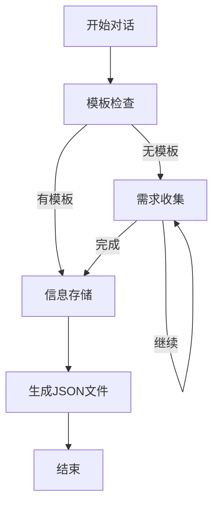

# 📊 Excel表格生成智能助手

一个基于LangGraph和Gradio的智能对话式Excel表格设计系统，通过自然语言对话帮助用户设计和生成复杂的Excel表格结构。

## 🌟 主要功能

- **🎯 智能需求分析**: 通过对话了解用户的表格用途和目标
- **📋 自动结构设计**: 基于需求自动设计表头和数据字段
- **🏗️ 多级表头支持**: 创建复杂的嵌套表格结构
- **📄 文件上传**: 支持上传参考文件和模板
- **💬 实时对话**: 美观的Gradio聊天界面
- **📊 JSON输出**: 生成标准化的表格结构文件

## 🚀 快速开始

### 1. 安装依赖

```bash
pip install -r requirements.txt
```

### 2. 配置环境变量

创建 `.env` 文件并添加OpenAI API密钥：

```bash
OPENAI_API_KEY=your_openai_api_key_here
```

### 3. 启动聊天界面

```bash
python launch_chatbot.py
```

浏览器将自动打开 `http://localhost:7860`

### 4. 开始对话

告诉智能助手您想创建什么样的表格，它会引导您完成整个设计过程！

## 📁 项目结构

```
ExcelAssist/
├── nodes/                          # 智能体节点
│   ├── __init__.py
│   └── frontdesk.py                # 前台接待智能体
├── utilities/                      # 工具模块
│   ├── __init__.py
│   ├── chatbox.py                  # Gradio聊天界面
│   └── visualize_graph.py          # 工作流可视化
├── table_template/                 # 生成的表格模板
├── launch_chatbot.py               # 界面启动器
├── test_chatbot.py                 # 功能测试脚本
├── requirements.txt                # 依赖列表
└── README.md                       # 项目文档
```

## 🤖 智能体工作流



## 💬 使用示例

### 对话流程示例

**用户**: 我想创建一个员工信息管理表格

**智能助手**: 好的！请告诉我这个表格的用途是什么？

**用户**: 用来管理公司员工的基本信息和工作情况

**智能助手**: 明白了。您希望包含哪些具体字段？

**用户**: 需要姓名、工号、部门、职位、入职日期、薪资等

**智能助手**: 是否需要多级表头分组？

**用户**: 是的，按基本信息和工作信息分组

**智能助手**: 完成！已为您生成表格结构文件 ✅

## 📊 输出格式

生成的JSON文件包含完整的表格结构信息：

```json
{
  "session_id": "unique-session-id",
  "timestamp": "2025-06-10T10:44:34.657358",
  "table_info": {
    "purpose": "表格用途",
    "description": "详细描述",
    "data_sources": ["数据来源"],
    "target_users": ["目标用户"],
    "frequency": "使用频率"
  },
  "table_structure": {
    "has_multi_level": true,
    "multi_level_headers": [
      {
        "name": "分组标题",
        "children": [
          {
            "name": "字段名",
            "description": "字段说明",
            "data_type": "text|number|date|boolean",
            "required": true,
            "example": "示例数据"
          }
        ]
      }
    ]
  },
  "additional_requirements": {
    "formatting": ["格式要求"],
    "validation_rules": ["验证规则"],
    "special_features": ["特殊功能"]
  }
}
```

## 🎨 界面特色

- **📱 响应式设计**: 适配各种屏幕尺寸
- **🎯 直观操作**: 清晰的聊天界面和文件上传区
- **📋 实时反馈**: 即时显示对话历史和处理状态
- **🔄 会话管理**: 支持重置对话和清空历史
- **📁 文件支持**: 支持多种文件格式上传

## 🛠️ 高级功能

### 文件上传支持

支持的文件类型：
- 📄 文本文件 (.txt, .md)
- 📊 CSV 文件 (.csv)
- 🗂️ JSON 文件 (.json)
- 📈 Excel 文件 (.xlsx, .xls)

### 自定义配置

可以通过修改配置参数自定义：
- LLM模型选择
- 服务器端口
- 界面主题
- 对话策略

### API集成

```python
from nodes.frontdesk import FrontDeskAgent

# 创建智能体
agent = FrontDeskAgent()

# 处理用户消息
result = agent.process_user_message("我想创建一个表格", session_id="user123")
```

## 🧪 测试

运行测试脚本验证功能：

```bash
python test_chatbot.py
```

## 📄 许可证

MIT License

## 🤝 贡献

欢迎提交Issue和Pull Request！

---

**�� 开始您的智能表格设计之旅吧！** 